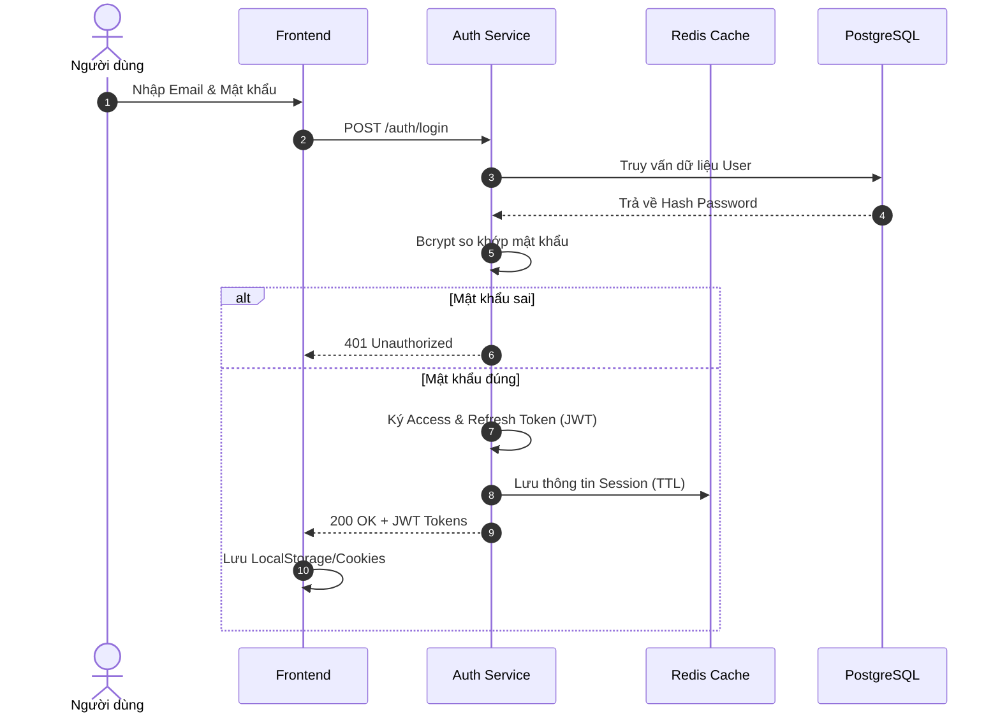
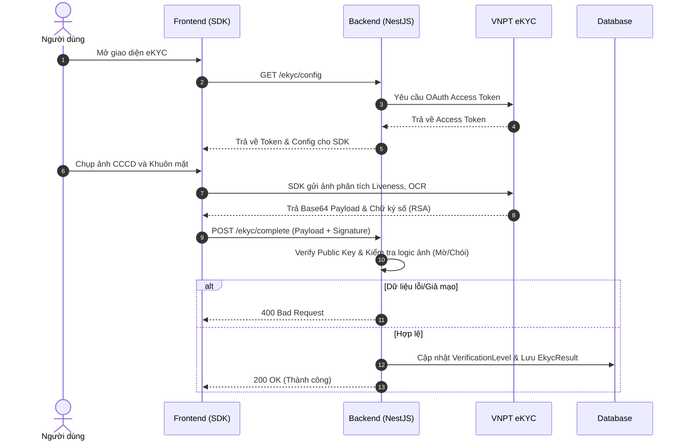
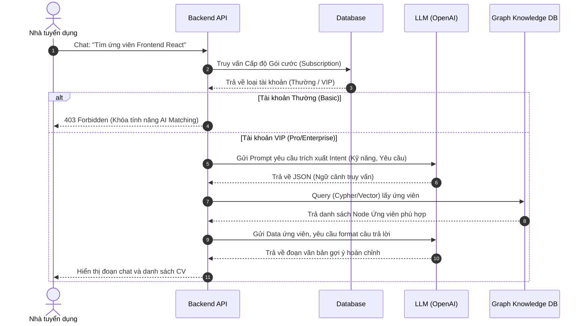
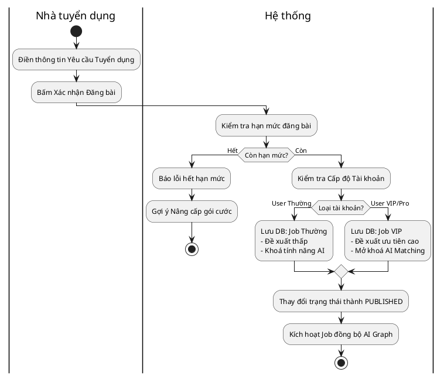
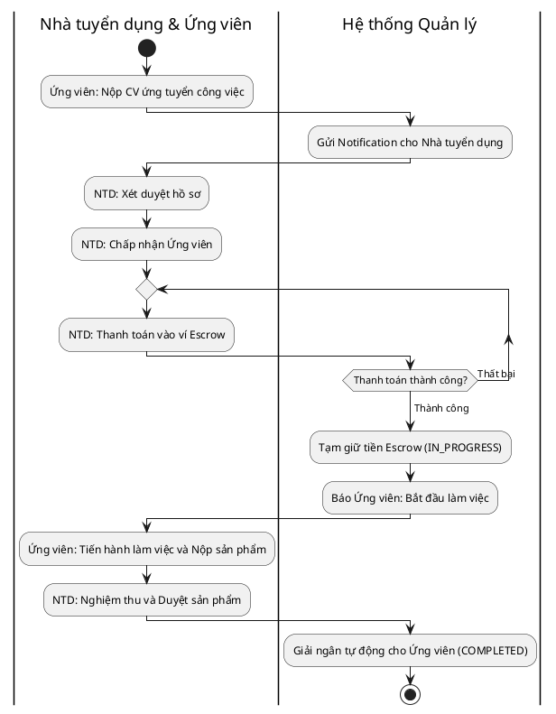
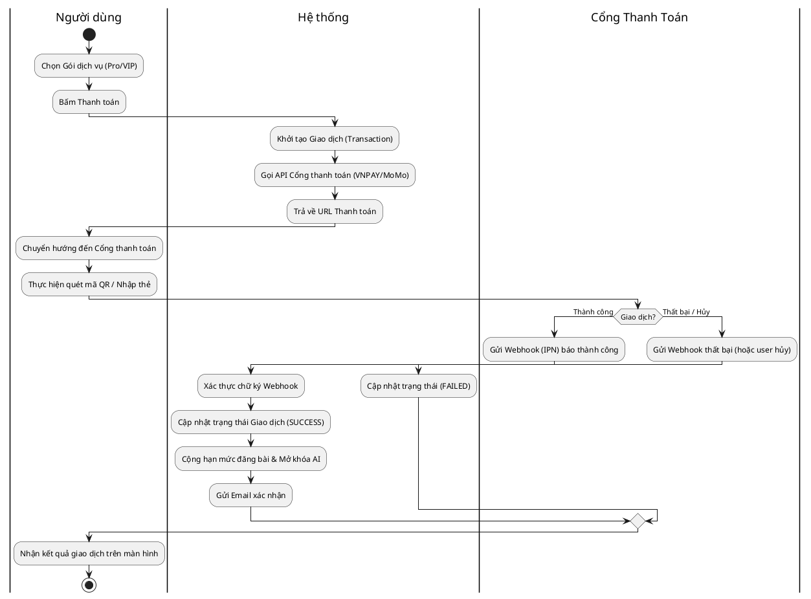
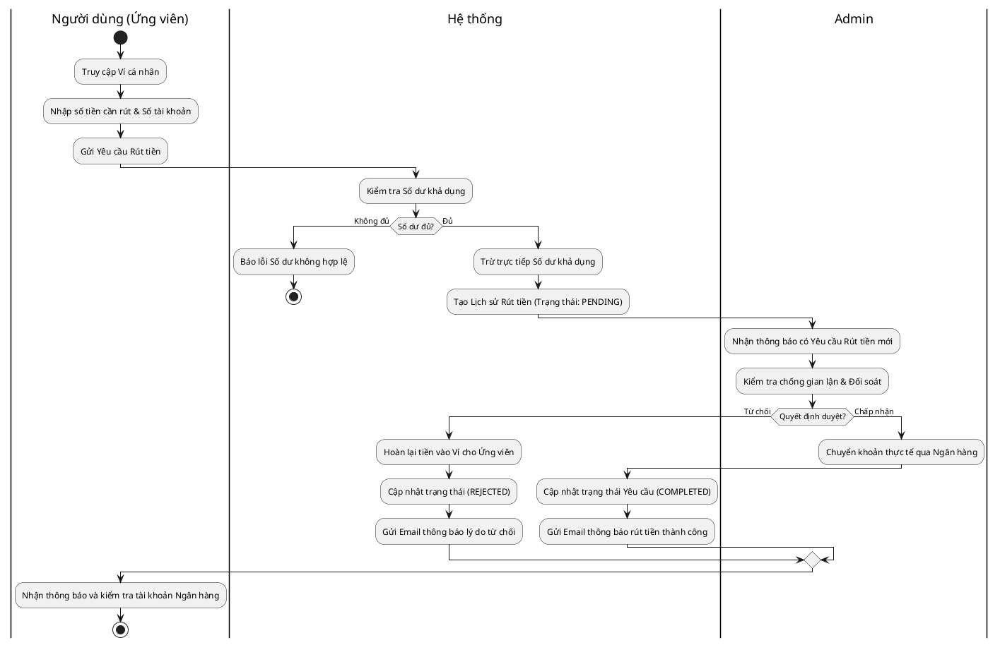

# Hướng dẫn Phân biệt & Tổng hợp Sơ đồ UML (Sequence & Activity)

## 1. Khi nào dùng Sơ đồ tuần tự (Sequence) và Sơ đồ hoạt động (Activity)?

Để báo cáo đồ án tốt nghiệp chuẩn tính hàn lâm và chuyên ngành Kỹ thuật phần mềm, việc phân định rõ khi nào vẽ sơ đồ nào là bắt buộc:

- **Sơ đồ tuần tự (Sequence Diagram):** 
  - **Mục đích:** Thể hiện **trình tự giao tiếp (gọi hàm, API, truy xuất DB) theo dòng thời gian** giữa các đối tượng hoặc các thành phần hệ thống với nhau. 
  - **Khi nào dùng:** Đối với các chức năng nặng về **kỹ thuật (Technical)**, có sự trao đổi dữ liệu qua lại nhiều vòng giữa Client - Backend - Database - 3rd Party API.
  - **Các chức năng áp dụng trong đồ án:**
    - Đăng nhập (giao tiếp với DB, tạo JWT, lưu Redis).
    - Xác thực eKYC (giao tiếp Frontend - Backend - VNPT Provider).
    - Chatbot tìm kiếm AI (giao tiếp Backend - LLM Service - Graph Database).

- **Sơ đồ hoạt động (Activity Diagram):**
  - **Mục đích:** Thể hiện **luồng điều khiển nghiệp vụ (Workflow)** từ đầu đến cuối, đặc biệt tập trung vào các rẽ nhánh logic (If/Else) và sự phân công công việc (ai làm việc gì - Swimlanes).
  - **Khi nào dùng:** Đối với các **nghiệp vụ kinh doanh (Business Logic)** có nhiều bước nối tiếp nhau, nhiều điều kiện xét duyệt, và có nhiều người dùng (Role) tham gia vào hệ thống.
  - **Các chức năng áp dụng trong đồ án:**
    - Đăng bài tuyển dụng (Logic kiểm tra gói cước người dùng, đồng bộ dữ liệu ngầm).
    - Quy trình Ứng tuyển & Thanh toán Escrow (Các bước từ apply, duyệt hồ sơ, thanh toán ví tạm giữ, bàn giao việc, giải ngân).

---

## 2. Các Sơ đồ Tuần tự (Sequence Diagrams)

### 2.1. Sơ đồ tuần tự: Đăng nhập & Xác thực Token
*Mô tả cách thức Client gọi API, Backend kiểm tra DB và cấp phát/quản lý Session qua Redis.*

### 2.2. Sơ đồ tuần tự: Xác thực định danh điện tử (eKYC)
*Mô tả cách ứng dụng trao đổi payload mã hoá và chữ ký số với đối tác VNPT eKYC.*

### 2.3. Sơ đồ tuần tự: Tương tác Chatbot AI & GraphRAG
*Thấy rõ cách Backend gọi LLM phân tích ý định, sau đó mới gọi Graph DB để lấy thông tin.*

---

## 3. Các Sơ đồ Hoạt động (Activity Diagrams - Sử dụng Swimlanes)

### 3.1. Sơ đồ hoạt động: Luồng Đăng công việc (Có nghiệp vụ xét duyệt Gói cước)
*Phân rõ hành động bấm tạo Job của người dùng và các bước kiểm duyệt tự động trong Hệ thống.*

### 3.2. Sơ đồ hoạt động: Luồng Ứng tuyển & Thanh toán tạm giữ (Escrow Workflow)
*Đây là quy trình nghiệp vụ phức tạp nhất, đi qua 3 giai đoạn: Ứng tuyển -> Giữ tiền Escrow -> Làm việc & Giải ngân.*

### 3.3. Sơ đồ hoạt động: Quy trình Thanh toán Mua Gói Dịch Vụ (Subscription Checkout)
*Mô tả cách thức người dùng nâng cấp gói cước và quá trình hệ thống nhận Webhook (IPN) từ cổng thanh toán để tự động cấp quyền.*

### 3.4. Sơ đồ hoạt động: Quy trình Rút Tiền từ Ví (Withdrawal Request)
*Dành cho nền tảng Freelance: Ứng viên sau khi hoàn thành công việc sẽ có số dư trong ví, yêu cầu rút tiền và chờ Admin duyệt đối soát.*

